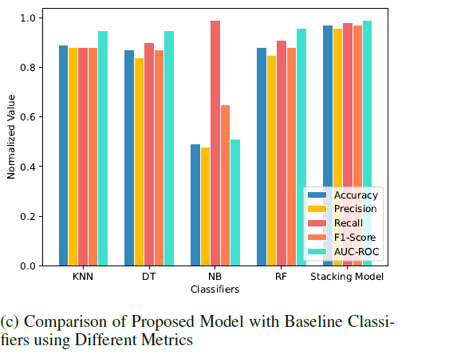

**Title: A New Framework for Fraud Detection in Bitcoin Transactions through Ensemble Stacking Model in Smart Cities**

**Authors:**

- Noor Nayyir
- Nadeem Javaid (Corresponding Author)
- Mariam Akbar
- Abdulaziz Aldegheishem
- Nabil Alrajeh
- Mohsin Jamil

**Abstract:**

- Bitcoin is often associated with illegal activities (money laundering, dark web transactions, ransomware payments).
- Blockchain technology prevents illegal transactions but does not detect them.
- Anomaly detection is crucial for recognizing potential fraud.
- Previous methods (heuristic and signature-based) were insufficient.
- Machine Learning (ML) is proposed as a solution for anomaly detection.
- The paper presents an ensemble stacking model using various ML classifiers for fraud detection in Bitcoin transactions.

---

**Key Contributions:**

- **Data Balancing:** Utilizes hybrid balancing techniques (ADASYN-TL) to improve model accuracy.
- **Hyperparameter Tuning:** Employs random search, grid search, and Bayesian optimization for tuning classifier parameters.
- **Model Construction:** Proposes a stacking model combining Decision Tree (DT), Naive Bayes (NB), K-Nearest Neighbors (KNN), and Random Forest (RF).
- **Model Evaluation:** Uses SHAP for interpreting model predictions and evaluates performance using metrics like accuracy, F1-score, AUC-ROC, precision, recall, and False Positive Rate (FPR).

---

**Motivation:**

- Existing methods fail to address the complexity of anomaly detection in Bitcoin transactions.
- Need for an efficient fraud detection model that overcomes limitations of previous techniques.

---

**Methodology:**

1. **Dataset:**
    
    - Utilizes the Bitcoin Heist Ransomware dataset.
    - Filters out records with transfer amounts less than 0.3 Bitcoin.
    - Dataset reduced to 381,464 instances after preprocessing.
2. **Data Balancing Techniques:**
    
    - ADASYN-TL (Adaptive Synthetic + Tomek Link) is used to balance the dataset.
    - Ensures that the model performs well on balanced data.
3. **Hyperparameter Tuning:**
    
    - Random search is preferred for efficiency over grid search and Bayesian optimization.
4. **Stacking Model:**
    
    - Combines predictions from multiple classifiers (DT, NB, KNN) with RF as a meta-model.
    - Aims to improve accuracy and reduce overfitting.

---

**Results:**

- The stacking model achieved:
    - Accuracy: 97%
    - F1-score: 97%
    - Precision: 96%
    - Recall: 98%
    - AUC-ROC: 99%
    - FPR: 3%
- ADASYN-TL outperformed SMOTE-ENN in terms of F1-score.

---

**Evaluation Metrics:**

- **Accuracy:** Percentage of correctly classified instances.
- **Precision:** True positives out of all predicted positives.
- **Recall:** True positives out of all actual positives.
- **F1-score:** Harmonic mean of precision and recall.
- **AUC-ROC:** Area under the curve for the receiver operating characteristic.

---

# Algorithm 1 Adaptive Synthetic-Tomek Link

The Adaptive Synthetic-Tomek Link (AdaSyn-TL) algorithm is a method for handling imbalanced datasets. It combines two techniques: **Adaptive Synthetic Sampling** (AdaSyn) and **Tomek Links** to balance the dataset by generating synthetic samples and removing noisy samples. Here's a summary of how it works:

1. **Determine Minority to Majority Ratio**: It calculates the ratio of minority class (ms) to majority class (mi) samples.

2. **Calculate Synthetic Samples**: Based on the difference between minority and majority samples, it decides how many synthetic samples (C) need to be generated to balance the dataset.

3. **K-Nearest Neighbors (KNN)**: For each minority sample, it identifies the K nearest neighbors.

4. **Generate Synthetic Samples**: It generates synthetic samples based on these neighbors to increase the minority class size.

5. **Tomek Link**: It then applies Tomek Link, which is a technique to identify and remove noisy or overlapping samples from the majority class. It selects random majority class samples and checks if they are nearest neighbors to minority samples.

6. **Remove Noisy Samples**: If a minority class sample is a nearest neighbor to a majority class sample, a Tomek Link is formed, and the noisy majority class sample is removed.

This approach helps improve the quality and balance of the dataset by increasing the minority class size with synthetic samples and cleaning up noisy majority class samples.

## EBD: Proposed Ensemble Bitcoin Detector Model Framework

- We used four different supervised
learning techniques RF, DT, NB, and KNN (RDNK).

- First of all, the dataset is loaded and is checked for
the outliers. If outliers are found, they are removed.

- After that, the dataset is balanced using the balancing technique and is splitted into two sets: training and testing.

- Hyperparameter tuning is performed before classification. In the end, the model is evaluated using different performance indicators.

### Using Hyperparameter tuning in Stacking Model

**Go to Page 20**

# Conclusion

- This paper presents the model for detecting fraud in Bitcoin transactions taking place in the smart cities.

- Firstly, ==**381464 instances are extracted out of 2916697**== instances, by setting a threshold value on the year and the transfer amount.

- The amount filter is used to exclude the instances that are outside the range and the year filter is used to exclude the data beyond the 2016 year.

- After the data is gathered, we remove outliers from the
data and then balance the dataset using ADASYN-TL, as the dataset is highly imbalanced.

- Random search, grid search, and Bayesian optimization hyperparameter tuning techniques are used to find the specific value for the parameters of the classifier.

- For classification, the stacking model is formed by combining DT, KNN, and NB on the base layer and using RF on the meta layer.

- The performance of the proposed model is validated by
comparing it with different classifiers. SHAP is used
to provide the information about the impact of features
on the model’s prediction.
