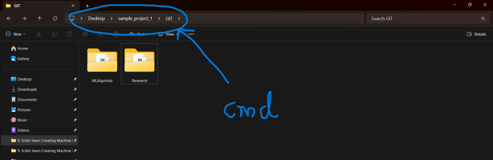
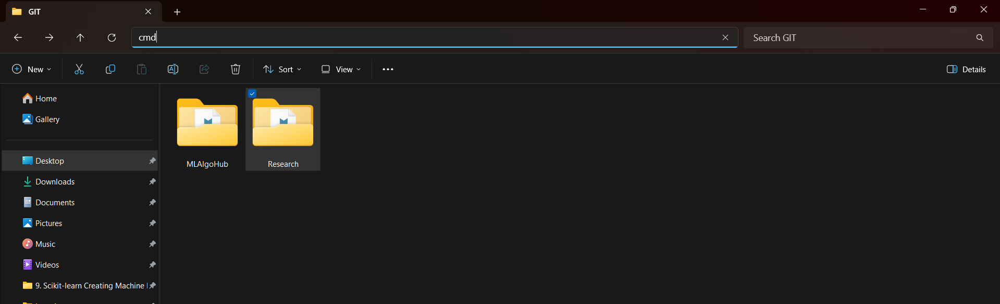

# Getting Started with Git: Example Workflow

This document explains how to get started with Git using an example workflow run on a local machine. Each section describes the commands used, the general syntax, and the specific example commands.

---

## 1. Cloning a Repository

**Command:**
```bash
$ git clone <repository-url>
```

**Example:**
*git clone https://github.com/divyanshsaxena21/Research.git*

      --> NOTE:  This will clone the **MAIN branch**

## ****Instead of this Clone your Specific Branch using...****

**Command:**
```bash
$ git clone -b <branch-name> <repository-url>
```

Output:
```
Cloning into 'Research'...
remote: Enumerating objects: 42, done.
remote: Counting objects: 100% (42/42), done.
remote: Compressing objects: 100% (33/33), done.
remote: Total 42 (delta 12), reused 14 (delta 3), pack-reused 0
Receiving objects: 100% (42/42), 1.50 MiB | 2.69 MiB/s, done.
Resolving deltas: 100% (12/12), done.
```

---

## 2. Opening the Project in VS Code


#### --> Open CMD at the Correct Directory where you cloned the Repository






### --> Press ENTER, then on CMD prompt write...


**Command:**
```bash
$ code .
```

**Example:**
*code .*

---

## 3. Checking Git Status

**Command:**
```bash
$ git status
```

### Initial Attempt (Wrong Directory):
*git status*

Output:
```
fatal: not a git repository (or any of the parent directories): .git
```

### After Changing Directory:
**Command:**
```bash
$ cd <repository-folder>
```

*cd Research*

*git status*

Output:
```
On branch Divyansh
Your branch is up to date with 'origin/Divyansh'.

Untracked files:
  (use "git add <file>..." to include in what will be committed)
        2212991.jpg

nothing added to commit but untracked files present (use "git add" to track)
```

---

## 4. Adding Files to Staging

**Command:**
```bash
$ git add .
```

**Example:**
*git add .*

Output:
```
On branch Divyansh
Your branch is up to date with 'origin/Divyansh'.

Changes to be committed:
  (use "git restore --staged <file>..." to unstage)
        new file:   2212991.jpg
```

---

## 5. Committing Changes

**Command:**
```bash
$ git commit -m "<commit-message>"
```

**Example:**
*git commit -m "new_file_my_image"*

Output:
```
[Divyansh f965dd3] new_file_my_image
 1 file changed, 0 insertions(+), 0 deletions(-)
 create mode 100644 2212991.jpg
```

---

## 6. Pushing Changes

**Command:**
```bash
$ git push origin <branch-name>
```

**Example:**
*git push origin Divyansh*

Output:
```
Enumerating objects: 4, done.
Counting objects: 100% (4/4), done.
Delta compression using up to 20 threads
Compressing objects: 100% (3/3), done.
Writing objects: 100% (3/3), 73.92 KiB | 14.78 MiB/s, done.
Total 3 (delta 1), reused 0 (delta 0), pack-reused 0
remote: Resolving deltas: 100% (1/1), completed with 1 local object.
To https://github.com/divyanshsaxena21/Research.git
   a0db507..f965dd3  Divyansh -> Divyansh
```

---

## 7. Pulling Changes

**Command:**
```bash
$ git pull
```

**Example:**
*git pull*

Output:
```
remote: Enumerating objects: 3, done.
remote: Counting objects: 100% (3/3), done.
remote: Compressing objects: 100% (2/2), done.
remote: Total 2 (delta 1), reused 0 (delta 0), pack-reused 0
Unpacking objects: 100% (2/2), 886 bytes | 221.00 KiB/s, done.
From https://github.com/divyanshsaxena21/Research
   f965dd3..6498738  Divyansh   -> origin/Divyansh
Updating f965dd3..6498738
Fast-forward
 2212991.jpg | Bin 85213 -> 0 bytes
 1 file changed, 0 insertions(+), 0 deletions(-)
 delete mode 100644 2212991.jpg
```

---

## 8. Viewing Commit History

**Command:**
```bash
$ git log --oneline
```

**Example:**
*git log --oneline*

Output:
```
6498738 (HEAD -> Divyansh, origin/Divyansh) Delete 2212991.jpg
f965dd3 new_file_my_image
a0db507 Update Notes.md
68f8ef2 Update Notes.md
242b9ad Delete .obsidian directory
1669187 second
9477fb4 first
fcb4581 Initial commit
```

---

## 9. Switching Branches

**Command:**
```bash
$ git checkout <branch-name>
```

**Example:**
*git checkout Aryan_Katiyar*

Output:
```
branch 'Aryan_Katiyar' set up to track 'origin/Aryan_Katiyar'.
Switched to a new branch 'Aryan_Katiyar'
```

To switch back:
*git checkout Divyansh*

Output:
```
Switched to branch 'Divyansh'
Your branch is up to date with 'origin/Divyansh'.
